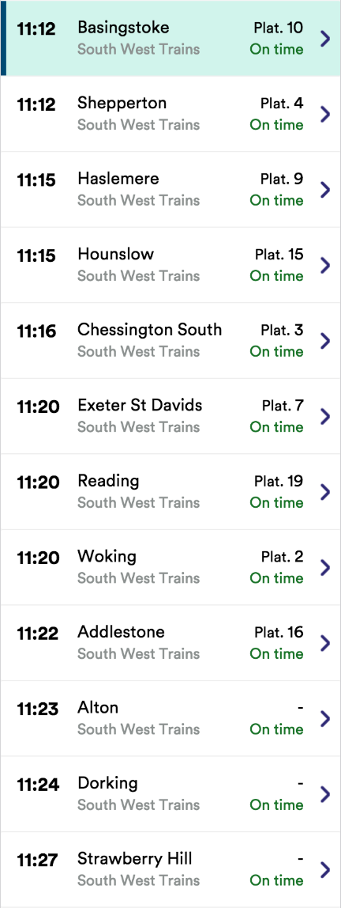
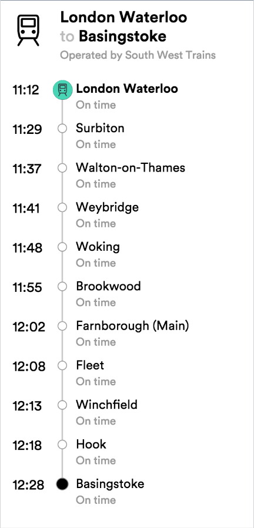

# Node.js Developer

Design a back-end API in node that can be consumed by a front-end in order to display train services in order for our customers to view live departure information on a mobile website.

Provide an endpoint for departures that requests a list of departures from our real-time API, e.g. [https://realtime.thetrainline.com/departures/wat](https://realtime.thetrainline.com/departures/wat), given the following mockup from the designers

Provide an endpoint for the selected service that lists the calling pattern for that service, with all required data given the following mockup from the designers

## For each

- Provide suitable response formats for both endpoints
- Assume the client will request departures from a station by code
- You can get a mapping of station codes (CRS codes) to names at [http://www.nationalrail.co.uk/stations_destinations/48541.aspx](http://www.nationalrail.co.uk/stations_destinations/48541.aspx)
- Include only services where transport mode is TRAIN
- Access to the API is not free - identify opportunities to cache

## We'll be looking for

- Appropriate HTTP status codes for errors
- Appropriate request validation
- Appropriate test coverage
- Appropriate use of mocking
- Appropriate HTTP headers - CORS?
- Appropriate logging. As a developer, how can I be made aware of an error for a given request and be in a position to investigate it?
- How might you document the endpoints?

## Questions for the interview

How do you manage configuration? - We have a development version of the realtime API we should use for CI.

How do you manage node process when the service is deployed?
